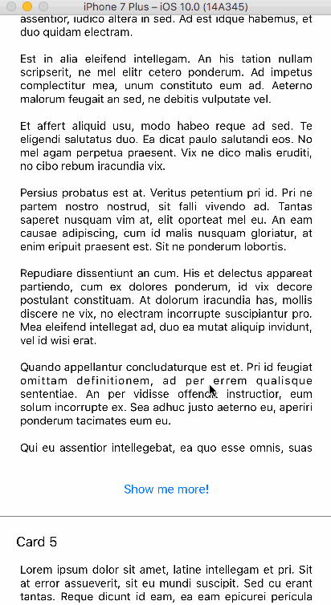

[](http://www.cocoapods.org/?q=cardscrollview)


A custom UIScrollView that enables vertical paging without limiting the page height.

# Screenshot

<p align="center">
  
</p>

# Setup with CocoaPods

```
use_frameworks!

pod 'CardScrollView'
```

## Usage

Make sure to use a subclass of `CardScrollView` for your `UIView`. Either set the class of your `UIView` in your storyboard, or create programmatically a `CardScrollView` instance in your code.

Set up a `cardScrollViewDataSource` and `CardScrollViewDelegate` just like you would do it using a regular UITableView.

For better memory management `CardScrollView` is implementing an [Object Pool Pattern](https://en.wikipedia.org/wiki/Object_pool_pattern).

Just like with `UITableView` or `UICollectionView` you need to register a `NIB` or `Class Type` for a specific reuse identifier with one of following functions:
- `public func register(nib: UINib, forReuseIdentifier reuseIdentifier: String)`
- `public func register(class aClass: CardScrollView.CardScrollViewCard.Type, forReuseIdentifier reuseIdentifier: String)`

That's how you would do it with `NIB`:
```swift
cardScrollView.register(nib: UINib(nibName: "TextCard", bundle: nil), forReuseIdentifier: "TextCard")
```

**NOTE:** You can register unlimited number of `NIB` and `Class Type` objects at the same time.

When you are all set up, you need to configure your data source and delegate. The idea is that it works the same way as `UITableView`.

## CardScrollViewDataSource

Data source requires you to implement following methods:
- `public func numberOfCards() -> Int`
- `public func cardsCollection(cardsCollection: CardScrollView.CardScrollView, cardAtIndex index: Int) -> CardScrollView.CardScrollViewCard`

`numberOfCards()` should return number of cards that will be displayed in CardsScrollView. This value should be greater than zero.

`cardsCollection(cardsCollection: CardScrollView.CardScrollView, cardAtIndex index: Int)` is requesting you to provide a card object at a specific index. At this stage you should already have any registered `NIB` or `Class Type` object and dequeue it using a `dequeueСard(withIdentifier:)` function like below:

```swift
guard let card = cardsCollection.dequeueСard(withIdentifier: "TextCard") as? TextCard else {
    fatalError("Could not dequeue cell")
}
```

After that you can perform any set up actions on the card object and return it from the function.

## CardScrollViewDelegate

implementing setting up a delegate is not required but if you need to set up a custom card height, then delegate is your way to go. `CardScrollViewDelegate` defines a function `cardCollection(cardsCollection: CardScrollView, estimatedHeightForCardAtIndex index: Int) -> Float?`. You need to implement this function and return a desirable card height in case if it's height is larger than `CardScrollView` height. If desired height is less than `CardScrollView`, then minimal card height is used which is equal to `CardScrollView` height.

# Author
[Nikolay Sohryakov](https://ru.linkedin.com/in/nikolay-sohryakov-a3683435). Feel free to contact me if you need more details on how to use the framework or new features.

# Contributing
Feel free to submit pull requests with any fixes and improvements.

# License

The MIT License (MIT)
Copyright (c) 2016 Nikolay Sohryakov

Permission is hereby granted, free of charge, to any person obtaining a copy of this software and associated documentation files (the "Software"), to deal in the Software without restriction, including without limitation the rights to use, copy, modify, merge, publish, distribute, sublicense, and/or sell copies of the Software, and to permit persons to whom the Software is furnished to do so, subject to the following conditions:

The above copyright notice and this permission notice shall be included in all copies or substantial portions of the Software.

THE SOFTWARE IS PROVIDED "AS IS", WITHOUT WARRANTY OF ANY KIND, EXPRESS OR IMPLIED, INCLUDING BUT NOT LIMITED TO THE WARRANTIES OF MERCHANTABILITY, FITNESS FOR A PARTICULAR PURPOSE AND NONINFRINGEMENT. IN NO EVENT SHALL THE AUTHORS OR COPYRIGHT HOLDERS BE LIABLE FOR ANY CLAIM, DAMAGES OR OTHER LIABILITY, WHETHER IN AN ACTION OF CONTRACT, TORT OR OTHERWISE, ARISING FROM, OUT OF OR IN CONNECTION WITH THE SOFTWARE OR THE USE OR OTHER DEALINGS IN THE SOFTWARE.
